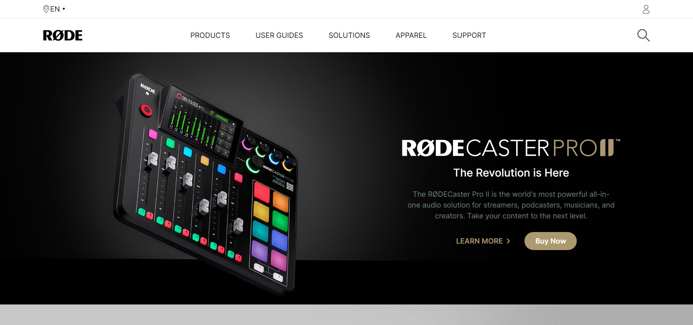
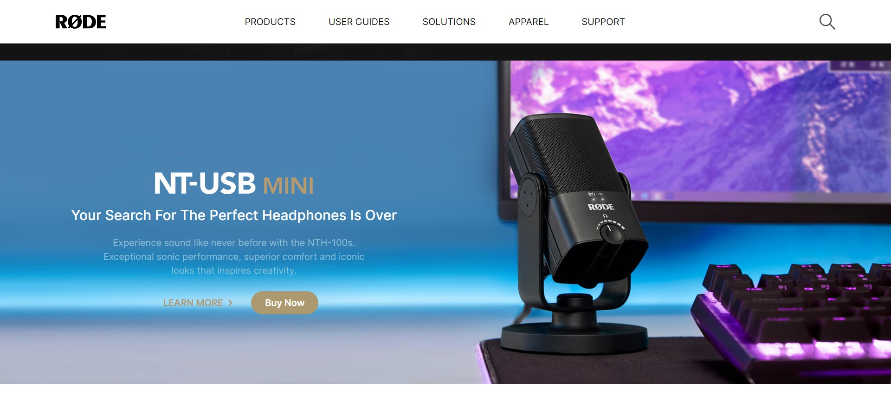

# ⭐ Rode-Clone-with-Tailwind-CSS⭐

## 🔗Project  Link
https://htmltailwind-rodeClone.netlify.app/

This is a assignment given in **"JavaScript Full Stack Web Developer Bootcamp"** by **iNeuron**, built using **HTML5 and TAILWIND CSS**.
 

 

## 📌 Tech Stack

&nbsp;
&nbsp;
 
 

## 📌 Overview

 

 "Template Screenshot")
 "Template Screenshot")

## 📌 What I Learn

    👉 Designing a same Layout using different concepts  
    👉 Classes, Selectors, Responsiveness using Tailwind CSS  
    👉 Responsive Sticky Navbar, Footer, Hero Sections.  
    👉 Different units like %,rem,em, ch,vh.  
    👉 Flexbox, Grid, Positions   
    
   

## Time taken to complete this project was **9 hr**.

## 📬 Connect With Me

- **LinkedIn** - [Pratyush Kesarwani](https://www.linkedin.com/in/pratyush-kesarwani-2b6601171/)

## 📌 Acknowledgments

- Course Instructor - [Hitesh Choudhary](https://github.com/hiteshchoudhary)
